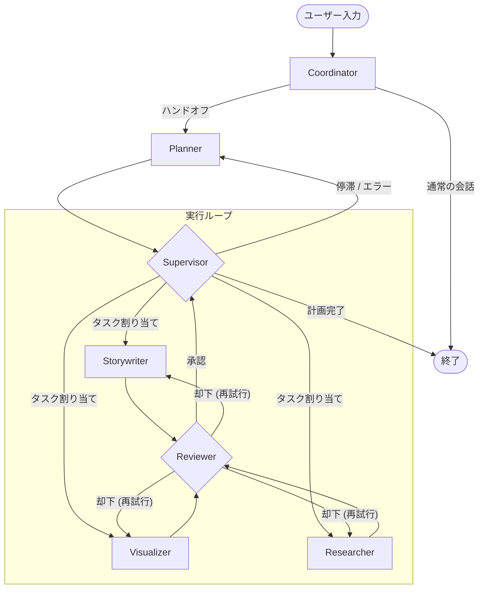

# システムアーキテクチャドキュメント

本書は **Lang-Manus** AIスライド生成システムの高レベルな概要を提供します。本システムは [LangGraph](https://langchain-ai.github.io/langgraph/) 上に構築されており、**Supervisor-Worker（監督者-作業者）** アーキテクチャと堅牢な **Reflexion（レビュー/再試行）** ループを採用しています。

---

## 1. システム概要

ユーザーの抽象的なリクエストを完全なスライドデッキに変換するために、複数の専門化されたエージェント（ノード）が協調して動作します。

### コアエージェント

| 役割 | 責務 |
| :--- | :--- |
| **Coordinator** | エントリーポイント。チャット対話を処理し、ユーザーの意図を明確化します。複雑なリクエストの場合は Planner へ「ハンドオフ」します。 |
| **Planner** | ユーザーの目的を構造化された段階的な実行計画（JSON）に分解します。 |
| **Supervisor** | **オーケストレーター（指揮者）**。状態を管理し、計画に基づいて適切な作業者へタスクをルーティングします。致命的な障害が発生した場合は動的な再計画（Dynamic Re-planning）を行います。 |
| **Reviewer** | **品質管理（QC）**のゲートキーパー。各作業者の成果物を評価します。基準（スコア/要件）を満たさない場合、作業者へ差し戻して修正を要求します。 |
| **Workers** | 特定のタスクを実行するドメイン専門家です。<br> • **Storywriter**: アウトラインとスライド本文を作成します。<br> • **Visualizer**: 画像プロンプトを作成し、画像を生成します（一貫性維持のためにアンカー戦略を使用）。<br> • **Researcher**: インターネット上の情報を収集します。<br> • **Data Analyst**: データを分析し、チャートの設計図を作成します。 |

---

## 2. データフローとアーキテクチャ

システムは循環グラフ構造（Cyclic Graph）に従います。スライド生成の典型的なフローは以下の通りです。

1.  **初期化 (Initialization)**: ユーザーがリクエストを送信します。
2.  **計画 (Planning)**: `Coordinator` が `Planner` に委譲し、計画を作成します。
3.  **実行ループ (Execution Loop)**:
    *   `Supervisor` が計画を読み、現在のステップの担当エージェント（例: `Storywriter`）にルーティングします。
    *   エージェントが実行し、**成果物 (Artifact)**（例: スライド構成案JSON）を生成します。
    *   `Reviewer` が成果物を評価します。
        *   **承認 (Approved)**: `Supervisor` に制御が戻り、次のステップへ進みます。
        *   **却下 (Rejected)**: エージェントに制御が戻り、フィードバックを元に再試行します。
4.  **視覚化 (Visualization)**: `Visualizer` が「Deep Edit」や「Style Anchor」などの戦略を用いて、承認された内容に合致する画像を生成します。
5.  **完了 (Completion)**: 全ステップが完了すると、`Supervisor` がワークフローを終了します。

### Mermaid ダイアグラム



---

## 3. 主要な概念とメカニズム

### A. Deep Edit & Visual Consistency (Visualizer)
`Visualizer` ノード (`src/graph/nodes.py`) は、スライド間での画像の一貫性を保つために3段階の戦略を実装しています。
1.  **戦略 A (Style Anchor)**: 専用の「スタイルアンカー」画像を最初に生成します。この画像のバイトデータを、後続の全スライドの参照画像として使用します。
2.  **戦略 B (Deep Edit)**: 編集作業時など、過去の実行で生成されたアンカー画像が存在する場合、それを再利用して一貫性を維持します。
3.  **戦略 C (Fallback)**: 明示的なスタイル定義がない場合、最初に生成されたスライド画像をアンカーとして使用します。

### B. Reflexion Loop (Reviewer)
`Reviewer` ノード (`src/graph/nodes.py`) は批評家（Critic）として振る舞います。構造化されたLLM呼び出しを使用して、以下の `ReviewOutput` オブジェクトを出力します。
*   `approved` (bool): 承認可否
*   `score` (0.0 - 1.0): 品質スコア
*   `feedback` (str): フィードバックコメント
`approved` が False の場合、グラフは作業者ノードに戻り、`retry_count`（再試行回数）が増加します。

---

## 4. 拡張ガイド

### 新しいノード（Worker）を追加する

1.  **ノードの定義**:
    `src/graph/nodes.py` に新しい関数を作成します。
    ```python
    def new_worker_node(state: State) -> Command[Literal["supervisor", "reviewer"]]:
        # 実装...
        return Command(..., goto="reviewer")
    ```

2.  **エージェントの登録**:
    `src/config/agents.py` にエージェントの設定（プロンプトやモデル）を追加します。

3.  **Configの更新**:
    `src/config/__init__.py` の `TEAM_MEMBERS` に新しいノード名を追加します。

4.  **グラフビルダーの更新**:
    `src/graph/builder.py` で、グラフにノードを追加します。
    ```python
    workflow.add_node("new_worker", new_worker_node)
    workflow.add_edge("new_worker", "reviewer")
    ```

### ツールを追加する

1.  **ツールの作成**: `src/tools/` 配下に LangChain 互換のツールを実装します。
2.  **モデルへのバインド**: `src/agents/__init__.py` で、特定のエージェントのモデルに新しいツールをバインドするように更新します。

---

## 5. 主要ファイルインデックス

| ファイルパス | 説明 |
| :--- | :--- |
| `src/graph/nodes.py` | **コアロジック**。全ノード（Supervisor, Reviewer, Workers）の実装が含まれます。 |
| `src/graph/builder.py` | **グラフ構築**。LangGraph のトポロジー（ノードとエッジ）を定義します。 |
| `src/service/workflow_service.py` | **エントリーポイント**。`run_agent_workflow` が実行管理とイベントストリーミングを担います。 |
| `src/config/settings.py` | **設定**。タイムアウト、再試行回数、制限値などを管理する Pydantic 設定ファイルです。 |
| `src/schemas/outputs.py` | **データモデル**。構造化出力（計画、スライド内容、レビュー結果）のための Pydantic モデルです。 |
| `src/utils/image_generation.py` | **ユーティリティ**。Vertex AI / Google GenAI による画像生成のラッパーです。 |
